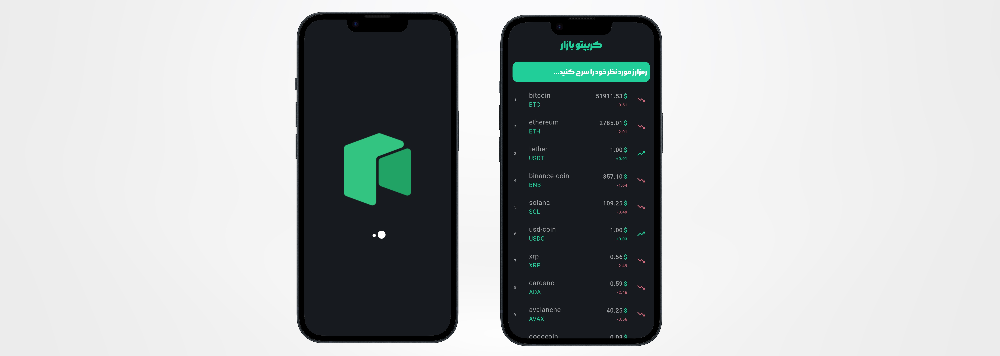

# Crypto-tacker

## Overview 

This is a crypto tracker app that fetches data from api and lists all the available coins with the precise price, rank, label, last 24H change, and change percentage during last 24H and shows whether the specific coin is in downtrend or uptrend respectively. The user has the ablity to search among the list and get the results. The project has been written with pure dart language and Bloc state management has been used to handle the structure of the project.

## Packages Used 
  - flutter_spinkit
  - dio
  - get_it
  - flutter_bloc
  - bloc
  - dartz

## Technologies Used 
 - Language : Dart 
 - Architecture : BLoC

## Project Structure 
 The project follows bloc architecture for the separation of layers:

  - BLoC : To handle the logic and send state for the unique event being received.
  - Data : To handle 3 important layers when working with API :
    - Model : which is the entity of the app.
    - DataSource : To recieve data from api and keep it (works just like usecases).
    - Repositoy : To get data from datasource and handle whether an error occurred or the list has been taken (similar to adapter layer).
  - UI : Infrastructure layer that is aware of the bloc and can send certain events to it.

## Project Setup 
To run the application do the following :

 1. Clone the repository or download it.
 2. Open the project in Android Studio / VScode.
 3. Build and run the app on an Android emulator or physical device by your choice.
